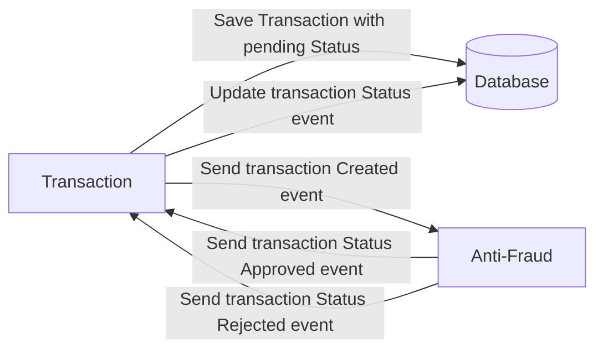

# Please read the README.md file in the challenge folder, or go to the end of the section or file to see the solution.
# Yape Code Challenge :rocket:

Our code challenge will let you marvel us with your Jedi coding skills :smile:. 

Don't forget that the proper way to submit your work is to fork the repo and create a PR :wink: ... have fun !!

- [Problem](#problem)
- [Tech Stack](#tech_stack)
- [Send us your challenge](#send_us_your_challenge)

# Problem

Every time a financial transaction is created it must be validated by our anti-fraud microservice and then the same service sends a message back to update the transaction status.
For now, we have only three transaction statuses:

<ol>
  <li>pending</li>
  <li>approved</li>
  <li>rejected</li>  
</ol>

Every transaction with a value greater than 1000 should be rejected.



# Tech Stack

<ol>
  <li>Node. You can use any framework you want (i.e. Nestjs with an ORM like TypeOrm or Prisma) </li>
  <li>Any database</li>
  <li>Kafka</li>    
</ol>

We do provide a `Dockerfile` to help you get started with a dev environment.

You must have two resources:

1. Resource to create a transaction that must containt:

```json
{
  "accountExternalIdDebit": "Guid",
  "accountExternalIdCredit": "Guid",
  "tranferTypeId": 1,
  "value": 120
}
```

2. Resource to retrieve a transaction

```json
{
  "transactionExternalId": "Guid",
  "transactionType": {
    "name": ""
  },
  "transactionStatus": {
    "name": ""
  },
  "value": 120,
  "createdAt": "Date"
}
```

## Optional

You can use any approach to store transaction data but you should consider that we may deal with high volume scenarios where we have a huge amount of writes and reads for the same data at the same time. How would you tackle this requirement?

You can use Graphql;

# Send us your challenge

When you finish your challenge, after forking a repository, you **must** open a pull request to our repository. There are no limitations to the implementation, you can follow the programming paradigm, modularization, and style that you feel is the most appropriate solution.

If you have any questions, please let us know.

# Solucion

La solución implementa un sistema de procesamiento de transacciones financieras. Cada transacción es recibida por el modulo transaction, validada a través de un microservicio anti-fraude y luego actualiza su estado según el resultado de dicha validación. Todo esto es manejado por el manejador de colas **Kafka**.

# Tecnologías Utilizadas

<ol>
  <li>NestJS</li>
  <li>Kafka</li>
  <li>TypeORM</li>
  <li>GraphQL</li>
  <li>Docker</li>
</ol>

# Despliegue

Para desplegar debes tener instalado Docker y Docker Compose, clonar el repositorio y ejecutar el comando **docker-compose up -d**, recuerda colocar y configurar las variables necesarias en el archivo **.env.example**.
Esto iniciará todas las dependencias y servicios definidos, incluidos la API, Kafka y la base de datos. 

# Uso

Una vez que los servicios estén en ejecución, la API estará disponible en *http://localhost:3000* y para graphql en *http://localhost:3000/graphql*

# API 

**Crear una transacción**
POST http://localhost:3000/transactions Envía un JSON con la estructura del objeto CreateTransactionInput para crear una nueva transacción.
**graphql**

  mutation :{
  createTransaction(
    createTransaction: {
      accountExternalIdDebit: "G",
      accountExternalIdCredit: "G",
      transferTypeId: 1,
      value: 100
    }
  ) {
    id
    ,accountExternalIdDebit
    ,accountExternalIdCredit
    ,transferTypeId
    ,value
    ,status
  }
}

**postman**

```json
{
  "accountExternalIdDebit": "Guid",
  "accountExternalIdCredit": "Guid",
  "tranferTypeId": 1,
  "value": 120
}
```

**Recuperar una transacción**
GET http://localhost:3000/transactions/{id} Reemplaza {id} con el identificador único de la transacción que deseas recuperar.
**graphql**

query {
  transaction(id: 1){
transactionExternalId
    transactionType {
      name
    }
    transactionStatus {
      name
    }
    value
    createdAt
  }
}

**Tipos de Transaction**
TransactionTypes = [
  { name: 'Deposit' },
  { name: 'Withdrawal' },
  { name: 'Transfer' },
  { name: 'Payment' }
];


**Listar todas las transacciones**
GET http://localhost:3000/transactions Este punto final devuelve un array con todas las transacciones registradas en el sistema.
**graphql**

query{
  transactions{
    transactionExternalId,
    transactionType{
      name
    },
    transactionStatus{
      name
    },
    value,
    createdAt
  }
}


# Consideraciones

Para una mayor optimización y mejora de la aplicación a futuro, lo ideal es crear particiones en Kafka por cada tipo de transferencia, y asi separarlas para un mejor procesamiento de las transacciones, pensando en que a diario se pueden recibir mas de 8 millones de esta.